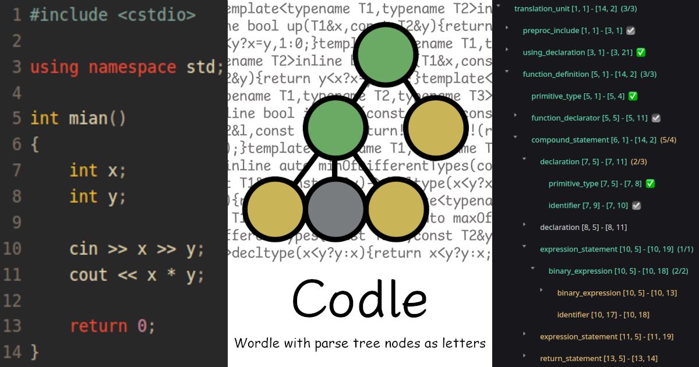

# Codle

Guess code like Wordle with parse tree nodes as letters. [Play it!](https://codle.ouuan.moe)

[](https://codle.ouuan.moe)

## Build

```bash
pnpm i
sudo pnpm build-treesitter:cpp # requires docker
pnpm serve
pnpm build
```

## Puzzles

The puzzles are in the `puzzles` directory which is not managed in this Git repository.

The file structure looks like this:

```
codle
├── package.json
└── puzzles
   ├── 1.cpp
   ├── 1.md
   ├── 2.cpp
   └── 2.md
```

You may need to calculate the week number or change `beginTimestamp` in [config.ts](config.ts).
